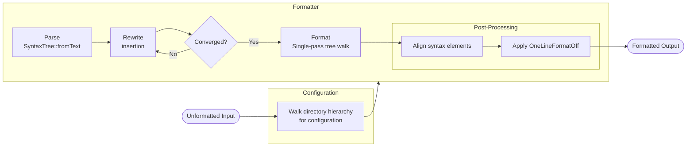

# Architecture

slang-format is an experimental SystemVerilog code formatter based on [slang][1]
and heavily inspired by [clang-format][2]. Verilog-2005 (IEEE 1364-2005) is
fully supported as a subset of the SystemVerilog language. All major operating
systems are supported, including Linux, macOS, and Windows.

## Dependencies

- [slang][1] - SystemVerilog compilation, elaboration, and analysis
- [yaml-cpp][3] - Parses configuration files written in YAML
- [GoogleTest][4] - Testing and mocking framework

## Directory Structure

```
slang-format/
├── source/
│   ├── Align.cpp         # Alignment post-processing
│   ├── Align.h           # Public interface for alignment post-processing
│   ├── FileLoader.cpp    # Directory hierarchy file search
│   ├── FileLoader.h      # FileLoader type alias and directory walk utility
│   ├── Format.cpp        # Single-pass formatting and post-processing
│   ├── Format.h          # Public interface for formatting and post-processing
│   ├── Ignore.cpp        # Ignore file lookup and pattern matching
│   ├── Ignore.h          # Public interface for ignore file support
│   ├── Rewriter.cpp      # Iterative syntax rewriting
│   ├── Rewriter.h        # Public interface for syntax rewriting
│   ├── Style.cpp         # Style configuration and YAML parsing
│   ├── Style.h           # Public interface for style configuration
│   ├── SyntaxHelper.h    # Shared predicates for syntax node classification
│   └── main.cpp          # Entry point; command-line processing and output
└── tests/
    ├── fixtures/         # CTest integration test scripts
    ├── AlignTest.cpp     # Alignment post-processing tests
    ├── FormatTest.cpp    # Formatting and post-processing tests
    ├── IgnoreTest.cpp    # Ignore file lookup and pattern matching tests
    ├── RewriterTest.cpp  # Syntax rewriting tests
    ├── StyleTest.cpp     # Style configuration and YAML parsing tests
    └── TestHelper.h      # Utilities for writing tests
```

## Formatting Flow



## Architectural Decisions

### Configuration Search

The configuration loader walks upward from the directory containing the source
file until it finds a `.slang-format` file or reaches the filesystem root,
returning default settings if none is found. This mirrors clang-format's
`.clang-format` lookup strategy, allowing per-project configuration without
explicit path arguments.

### Ignore File Lookup

The ignore file loader walks upward from the directory containing the source
file until it finds a `.slang-format-ignore` file, mirroring the configuration
file lookup. Ignore files are not merged across directory levels; a lower-level
file voids any higher-level ones.

Patterns use glob syntax with `*` and `?` for single-segment matching. Both `**`
(bash globstar) and `...` (LRM 33.3.1 recursive directory search) are accepted
for recursive directory matching. The `!` prefix negates a pattern, with
last-match-wins semantics.

### Configuration Dump

When adding a new configuration option, insert its key at the correct
alphabetical position in `dumpConfiguration()` and add a corresponding
round-trip test. When a shared struct contains fields that are unused by a
particular option, those fields must not be emitted.

The `--dump-config` option serializes the resolved style to a YAML document on
stdout, matching the behavior of `clang-format --dump-config`. Fields are emitted
in alphabetical order, wrapped with `---` and `...` document markers.

### Separate Structural and Formatting Passes

Structural AST changes (begin/end insertion) are handled by a dedicated rewrite
pass that produces a modified syntax tree before any formatting occurs. A
read-only formatting pass then emits output directly from the rewritten tree,
handling indentation, break insertion, empty line limiting, and pragma handling.

This separation keeps each concern in its natural abstraction: the rewrite pass
operates on tree structure, the formatting pass operates on token emission.

### Iterative Rewriting

slang's syntax rewriter imposes a constraint: it applies all registered changes
atomically, and replaced nodes are not re-visited. This means wrapping nested
constructs (e.g., an `if` body nested inside an `always` body) cannot be done
in a single pass.

The begin/end insertion pass handles this by iterating: each pass wraps the
outermost bare statements, and subsequent passes handle newly exposed inner
ones. The loop terminates when a pass produces no changes. Typical code
converges in 1-2 iterations; worst case is O(nesting depth).

### Single-Pass Formatting

The formatting pass performs a single traversal of the already-rewritten tree.
Carrying formatting state across the walk is straightforward to reason about,
and the single-pass constraint keeps the implementation linear and predictable.

### Post-Processing

#### Alignment

`Align.cpp` implements alignment and exposes it to the formatter through
`applyAlignment`. Alignment requires knowledge of multiple adjacent lines to
compute the maximum column width, which is incompatible with the single-pass
tree walk where each token is emitted independently. The tree walk populates a
per-line `LineMetadata` record as a side channel alongside the formatted output.
Each record carries the line's syntactic kind, AST nesting depth, and trailing
comment position. The alignment passes consume this metadata for line
classification and group formation, falling back to text-based classification
for line types not yet covered by metadata handlers. Position extraction for
column alignment is still performed by text scanning, since preceding alignment
passes may insert padding that shifts column positions from their original
values.

`applyAlignConsecutive` is a function template that drives group formation while
delegating break, start, and alignment decisions to per-alignment-type callbacks.
It drives all five alignment passes: packed dimensions, declarations, timing
controls, assignments, and trailing comments. Assignment alignment groups are
scoped by AST depth to avoid breaking groups at control-flow boundaries such as
`if`/`else` and `case`/`endcase`; assignments at different depths within a group
are aligned independently.

#### Indentation

The `OneLineFormatOffRegex` option strips indentation from lines matching a
regex. The formatter applies this as a post-processing pass over the
already-formatted string, because the regex needs the final rendered text that
only exists after the tree walk.

### Fixture Tests

Command-line features that live in `main.cpp` are not part of the object library
linked by unit tests. These features are tested using CTest integration tests
driven by CMake scripts under `tests/fixtures/`. Each script invokes the built
binary, then verifies output using `cmake -E compare_files` or similar checks.

[1]: https://sv-lang.com/
[2]: https://clang.llvm.org/docs/ClangFormat.html
[3]: https://github.com/jbeder/yaml-cpp
[4]: https://github.com/google/googletest
