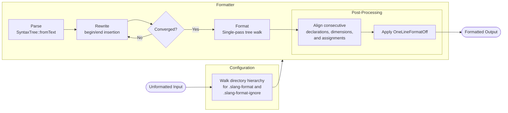

# Architecture

slang-format is an experimental SystemVerilog code formatter based on [slang][1]
and heavily inspired by [clang-format][2]. Verilog-2005 (IEEE 1364-2005) is
fully supported as a subset of the SystemVerilog language. All major operating
systems are supported, including Linux, macOS, and Windows.

## Dependencies

- [slang][1] - SystemVerilog compilation, elaboration, and analysis
- [yaml-cpp][3] - Parses configuration files written in YAML
- [GoogleTest][4] - Testing and mocking framework

## Directory Structure

```
slang-format/
├── source/
│   ├── Format.cpp        # Single-pass formatting and post-processing
│   ├── Format.h          # Public interface for formatting and post-processing
│   ├── Ignore.cpp        # Ignore file lookup and pattern matching
│   ├── Ignore.h          # Public interface for ignore file support
│   ├── Rewriter.cpp      # Iterative syntax rewriting
│   ├── Rewriter.h        # Public interface for syntax rewriting
│   ├── Style.cpp         # Style configuration and YAML parsing
│   ├── Style.h           # Public interface for style configuration
│   ├── SyntaxHelper.h    # Shared predicates for syntax node classification
│   └── main.cpp          # Entry point; command-line processing and output
└── tests/
    ├── fixtures/         # CTest integration test scripts
    ├── FormatTest.cpp    # Formatting and post-processing tests
    ├── IgnoreTest.cpp    # Ignore file lookup and pattern matching tests
    ├── RewriterTest.cpp  # Syntax rewriting tests
    ├── StyleTest.cpp     # Style configuration and YAML parsing tests
    └── TestHelper.h      # Utilities for writing tests
```

## Formatting Flow



## Architectural Decisions

### Configuration Search

The configuration loader walks upward from the current directory until it finds
a `.slang-format` file or reaches the filesystem root, returning default
settings if none is found. This mirrors clang-format's `.clang-format` lookup
strategy, allowing per-project configuration without explicit path arguments.

### Ignore File Lookup

The ignore file loader walks upward from the directory containing the source
file until it finds a `.slang-format-ignore` file, mirroring the configuration
file lookup. A lower-level ignore file voids any higher-level ones; ignore files
are not merged across directory levels.

Patterns use glob syntax with `*` and `?` for single-segment matching. Both `**`
(bash globstar) and `...` (LRM 33.3.1 recursive directory search) are accepted
for recursive directory matching. Internally, `**` is translated to `...` before
delegating to slang's `svGlobMatches`. Negation is supported via the `!` prefix,
with last-match-wins semantics.

### Configuration Dump

The `--dump-config` option serializes the resolved style to a YAML document on
stdout, matching the behavior of `clang-format --dump-config`. Fields are emitted
in alphabetical order, wrapped with `---` and `...` document markers. When a
shared struct contains fields that are unused by a particular configuration
option, those fields must not be emitted for that option. When a new
configuration option is added, its key must be inserted at the correct
alphabetical position in `dumpConfiguration()` and a corresponding round-trip
test added.

### Separate Structural and Formatting Passes

Structural AST changes (begin/end insertion) are handled by a dedicated rewrite
pass that produces a modified syntax tree before any formatting occurs. All
other formatting - indentation, break insertion, empty line limiting, pragma
handling - is performed by a read-only pass that emits formatted output directly
from the rewritten tree.

This separation keeps each concern in its natural abstraction: the rewrite pass
operates on tree structure, the formatting pass operates on token emission.

### Iterative Rewriting

slang's syntax rewriter applies all registered changes atomically. When a node
is replaced, the replacement is not re-visited for further changes. This means
wrapping nested constructs (e.g., an `if` body nested inside an `always` body)
cannot be done in a single pass.

The begin/end insertion pass handles this by iterating: each pass wraps the
outermost bare statements, and subsequent passes handle newly exposed inner
ones. Convergence is detected when a pass produces no changes. Typical code
converges in 1-2 iterations; worst case is O(nesting depth).

### Single-Pass Formatting

All formatting - indentation, break insertion, empty line limiting, pragma
handling - is performed in a single traversal of the already-rewritten tree.
Carrying formatting state across the walk is straightforward to reason about,
and the single-pass constraint keeps the implementation linear and predictable.

### Post-Processing

#### Alignment

Declaration alignment operates on the already-formatted output string rather than
during the tree walk. Alignment requires knowledge of multiple adjacent lines to
compute the maximum column width, which is incompatible with the single-pass tree
walk where each token is emitted independently. The line-based post-processing
approach avoids correlating tree structure with output positions and matches the
existing pattern established by `applyOneLineFormatOff`.

#### Indentation

The `OneLineFormatOffRegex` option strips indentation from lines matching a
regex. This is applied as a second pass over the already-formatted string rather
than inline during the tree walk, because the regex operates on final output
content that is not known until after the walk is complete.

### Fixture Tests

Command-line features that live in `main.cpp` are not part of the object library
linked by unit tests. These features are tested using CTest integration tests
driven by CMake scripts under `tests/fixtures/`. Each script invokes the built
binary, then verifies output using `cmake -E compare_files` or similar checks.

[1]: https://sv-lang.com/
[2]: https://clang.llvm.org/docs/ClangFormat.html
[3]: https://github.com/jbeder/yaml-cpp
[4]: https://github.com/google/googletest
